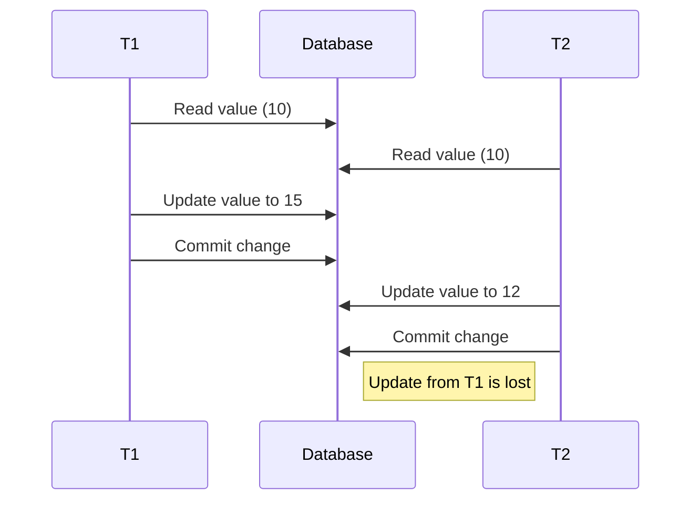
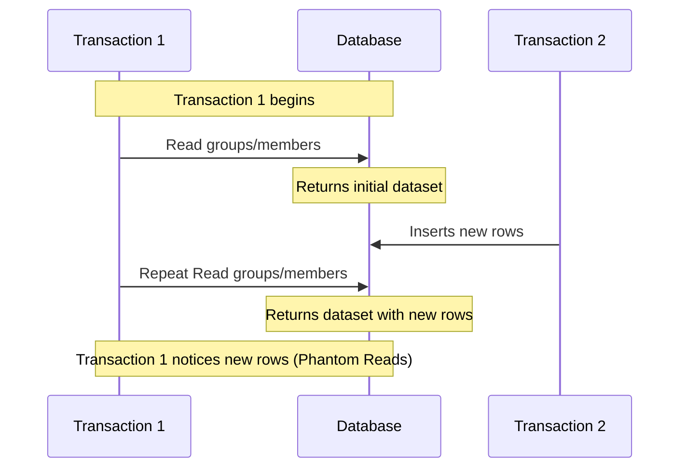
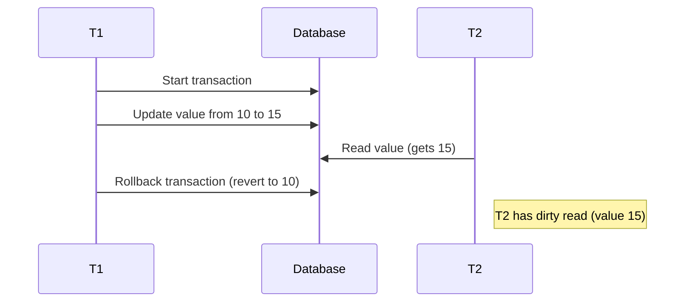

### Updating Trip Line Item:
Lost Updates: If two transactions concurrently read and then update a line item, one of the updates could overwrite the other, leading to a loss of data. To prevent this, we could set it to Serializable isolation level, in which transactions are executed in a way that provides the illusion that they are the only transactions interacting with the data. This prevents phenomena like lost updates by ensuring that the updates are not overwritten by other transactions.

### Search Line Items
Phantom Reads: This phenomenon, possible in 'REPEATABLE READ' isolation, refers to a transaction noticing new rows being added to the dataset it has queried. In your case, if the transaction involves reading groups or members and then repeats this read, it might find new groups or members that were not present in the initial read. To prevent this phenomenon, the isolation level has to be set to Serializable.

### List Expenses
Dirty Reads: If this endpoint retrieves a list of expenses while another transaction is adding, updating, or deleting an expense, and that transaction is rolled back, it could lead to dirty reads. Since the default isolation level in postgres is Read Committed, this phenomena will be prevented.

