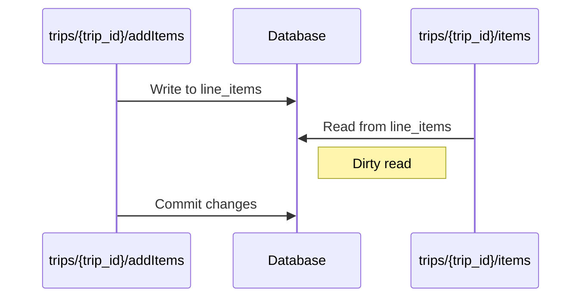
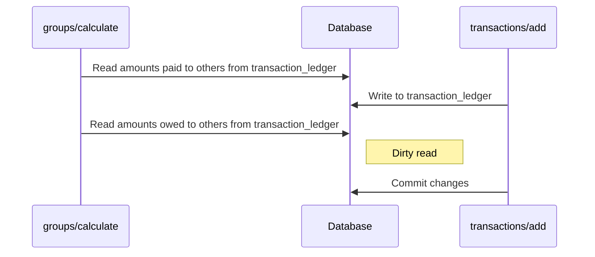

### Retrieving Line Items While New Ones are Added:
Dirty Read: A user A may want to add some new line items to a trip. Meanwhile, user B may try to retrieve the current line items, and read uncommited data from user A's transaction (which later gets rolled back due to some error). This is a dirty read.

### Calculate Dirty Read
Dirty Read: This is not possible with our implementation of our calculate endpoint, but if it were implemented in such a way that there were two separate SELECT statements, one to retrieve a user's total owed to their group members, and another to retrieve their total paid to their group members, which would then be added together to get the overall balance with each other member in their group, a dirty read could occur:
User A tries to calculate their current balance with their group, and the amount paid to others is read from the transaction ledger. Meanwhile, user B decides to pay user A back, writing to the transaction_ledger. User A then reads the amount owed to others from the transaction_ledger, which is now different due to user B's write. However, user B's transaction gets rolled back, and user A is left with a dirty read. 

